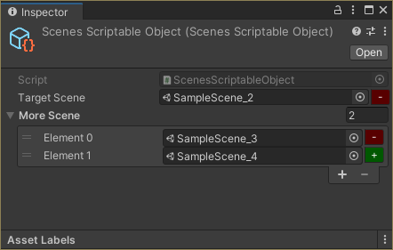
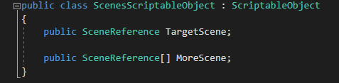

# Unity SceneReference
Keeps reference to a scene asset and tracks it's path in the editor, so it can be used in the game runtime.

## Why
It's a well known fact that scenes can't be referenced like prefabs, textures etc.
The [Unity SceneManager](https://docs.unity3d.com/ScriptReference/SceneManagement.SceneManager.html) API works with relative scene paths or names.

Use this class to avoid manually typing and updating scene path strings - it will try to do it for you as best as it can, including when <b>building the player</b>.

## Installation
* Download the single file directly: [SceneReference](Assets/DevLocker/Utils/SceneReference.cs)
* Github upm package - merge this to your `Packages/manifest.json`
```
{
  "dependencies": {
    "devlocker.utils.scenereference": "https://github.com/NibbleByte/UnitySceneReference.git#upm"
}
```

## Features
* The SceneReference class works on lists, scriptable objects, game objects, multiple-select.
* Small button on the right to add or remove from the build settings. The +/- sign and color indicate what the operation would be.
* Paths are updated during build (guaranteed by the [ISerializationCallbackReceiver](https://docs.unity3d.com/ScriptReference/ISerializationCallbackReceiver.html)).

Here is how it looks like:<br/>


Here is how it looks in debug mode (what data is stored):<br/>


Here is how it looks in the code:<br/>


## Credits
Using the [ISerializationCallbackReceiver](https://docs.unity3d.com/ScriptReference/ISerializationCallbackReceiver.html) was inspired by the [unity-scene-reference](https://github.com/JohannesMP/unity-scene-reference) implementation.